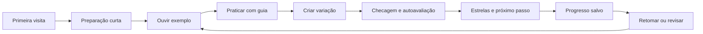

# 03 — Produto e MVP

Status: proposta de produto; público confirmado, escopo e regras ainda sujeitos ao piloto. Data: 6 de outubro de 2026.

## 1. Promessa e limites

“Abra o app, saiba o que praticar e crie uma pequena frase sobre um acompanhamento.” O aluno deve sair da primeira sessão com uma experiência musical compreensível e saber o próximo passo.

O foco é improvisação inicial para quem já toca acordes. Não é um curso integral de guitarra, um catálogo de todas as escalas nem um avaliador automático de performance no primeiro lançamento.

## 2. Escopo

| Essencial no MVP | Posterior |
| --- | --- |
| Trilha Fundamentos em português com 12 lições autorais | Novas trilhas, estilos e idiomas |
| Preparação curta e retomada da última lição | Nivelamento adaptativo complexo |
| Braço responsivo, recorte de casas e graus/notas explicados | Afinações alternativas, capotraste e outros instrumentos |
| Orientação para destros/canhotos com números de cordas | Personalizações extensivas |
| Demonstração sonora, pulso, contagem e vamps simples | Biblioteca de músicas comerciais e arranjos completos |
| BPM ajustável, pausa, repetição de trecho e volume | Reconhecimento de notas, ritmo e acordes por microfone |
| Exercícios visuais com resposta verificável | Nota automática para improvisação livre |
| Autoavaliação instrumental explícita | Gravação e análise remota |
| Explicação opcional por lição, com mapa mental curto | Curso teórico separado e enciclopédia musical |
| Tabelas, diagramas, mini braços e linhas do tempo contextualizados | Infográficos decorativos e telas com muitos elementos concorrentes |
| Estrelas, progresso por módulo e próxima ação | Rankings, desafios sociais, economia de moedas |
| Progresso local, backup JSON e recuperação | Contas, sincronização e pagamentos |
| Exploração secundária de pentatônicas e tônicas | Paridade completa com cromática, Ionian, boxes blues e editor de progressões |

O explorador não precisa impedir o início do piloto. A primeira fatia implementável terá três lições completas; o MVP publicado terá a trilha Fundamentos restante após validação. Congelar novas famílias musicais durante essa entrega.

## 2.1 Trilhas múltiplas

O produto terá uma trilha comum de **Fundamentos** e, depois dela, trilhas opcionais com objetivos e níveis diferentes. A trilha comum ensina localização no braço, pentatônica, ritmo, pausas, notas-alvo e primeiras trocas de acorde. Ela cria o vocabulário mínimo para que a escolha posterior seja compreensível.

As trilhas seguintes não serão apenas listas maiores de escalas. Cada uma terá uma promessa musical clara, um nível recomendado, pré-requisitos e uma progressão própria. Exemplos iniciais:

| Trilha | Foco | Pré-requisito sugerido |
| --- | --- | --- |
| **Fundamentos** | Primeiras frases, pentatônica menor, ritmo, resolução e mapa do braço | Nenhum |
| **Frases com intenção** | Motivos, variação, pausas, articulação e transposição curta | Fundamentos concluída ou primeira estrela nas lições essenciais |
| **Harmonia jazzística** | Acordes de sétima, notas do acorde, ii–V–I, condução de vozes e dominante alterado | Fundamentos + frases com intenção |
| **CAGED e o braço inteiro** | Conectar posições, tríades e arpejos em regiões diferentes | Fundamentos + mapa de uma posição |
| **Blues e linguagem** | Blues menor/maior, blue note, chamada e resposta e vocabulário transcrito | Fundamentos + prática rítmica |
| **Laboratório de linguagem** | Intervalos, fragmentos, uma posição, transposição e escolhas de timbre | Frases com intenção + uma posição do braço |

Na tela de trilhas, o participante pode explorar as opções, mas o app destaca uma recomendação: **continuar a trilha atual** ou **começar a próxima trilha recomendada**. Uma trilha pode estar disponível sem estar concluída; bloqueios rígidos ficam reservados a pré-requisitos que realmente evitem confusão. O progresso é salvo por `trackId` e `lessonId`, permitindo alternar entre trilhas sem perder a etapa atual.

Dentro de um módulo, o participante terá navegação explícita para **lição anterior**, **lição atual** e **próxima lição**. Lições já iniciadas ou concluídas podem ser revisitadas livremente para revisão. A próxima lição fica disponível quando seus pré-requisitos forem atendidos; se ainda estiver bloqueada, o botão explica o requisito e aponta para a lição recomendada. Voltar não apaga estrelas, pontos, tentativas ou a etapa salva. Ao sair no meio, a retomada retorna à etapa em que a pessoa parou, com opção de reiniciar a lição desde o começo.

Na landing page, cada trilha será um card selecionável com título, promessa, nível, duração aproximada da sessão inicial e botão de entrada. O card da trilha Fundamentos será recomendado para a primeira visita; a escolha de outra trilha deve mostrar os pré-requisitos antes de iniciar e oferecer a opção de começar pela preparação necessária. O nível é uma orientação de carga e vocabulário, não um julgamento permanente da pessoa.

O **Laboratório de linguagem** fica fora do MVP inicial. Ele representa a principal contribuição prática do método de Goodrick: transformar escalas, posições e intervalos em material próprio. A trilha deve liberar desafios como “toque em uma posição”, “use apenas três notas”, “responda com um salto de sexta”, “deixe um compasso de silêncio” e “leve o mesmo motivo para outro tom”. O app não precisa avaliar artisticamente a gravação; ele registra a tentativa e conduz a autoavaliação.

O estudo de Berliner acrescenta quatro critérios para desenhar cada exercício futuro:

1. **Ouvir antes de nomear**: tocar um exemplo curto antes de abrir graus, escalas ou diagramas.
2. **Separar ritmo e notas**: permitir desafios em que apenas uma dimensão muda por vez.
3. **Aprender em fragmentos**: oferecer frases pequenas, sempre com variações autorais e não como solos inteiros para decorar.
4. **Dar forma à sessão**: começar simples, criar densidade e terminar com uma resolução, para que o praticante sinta uma pequena narrativa musical.

Esses critérios não adicionam telas ao MVP. Eles orientam o conteúdo das três primeiras lições e servem como filtro para novas trilhas: uma atividade só entra quando produzir uma decisão musical audível e uma próxima tentativa clara.

## 2.2 Editor de lições criadas por praticantes — ideia futura

Depois que as lições oficiais e o contrato de conteúdo estiverem estáveis, considerar um editor visual para que praticantes criem exercícios próprios: escolher contexto harmônico, trecho do braço, notas e ritmo de uma frase, acompanhamento, instrução e critério de prática. O primeiro experimento pode ser **rascunho local com prévia e exportação/importação**, sem publicação pública nem conta. Isso também serviria à equipe para testar conteúdo novo sem alterar código a cada lição.

Compartilhar lições com outras pessoas seria uma etapa posterior e separada. Exigiria identidade/autoria, versões imutáveis para não quebrar o progresso de quem já começou, denúncia/moderação, atribuição e permissão para áudio, imagens e frases enviadas. Conteúdo criado pelo usuário deve passar pela mesma validação musical e estrutural das lições oficiais; o editor não pode inserir HTML ou JavaScript arbitrário no app.

Antes de priorizar o editor, validar se as pessoas concluem e revisitam as trilhas oficiais e se demonstram vontade de criar ou adaptar exercícios. A possibilidade fica registrada no roadmap, **fora do MVP e sem prazo**, para não desviar da primeira experiência de aprendizagem.

As lições criadas por pessoas terão a área **Minhas lições**, com coleções/categorias próprias, separada de **Trilhas oficiais**. Autoria, categoria e progresso não serão o mesmo campo: alguém poderá praticar uma lição compartilhada sem se tornar seu dono, e o criador poderá reorganizar suas categorias sem apagar tentativas. A identidade e a migração estão detalhadas em [09 — Lições oficiais e dos usuários](09-licoes-oficiais-e-dos-usuarios.md).

## 3. Jornada principal

Primeira visita: apresentação em uma frase, escolha de guitarra/violão e orientação, “Começar minha primeira frase”. Preferências de instrumento orientam instruções, sem criar dois currículos. Acesso à preparação não exige cadastro. Visitas seguintes abrem “Continuar” com a lição/etapa salva; revisão pendente aparece como sugestão secundária.

Durante prática: uma tarefa, poucas notas e controles acessíveis com o instrumento nas mãos. O fim de um timer não produz aprovação. Ao sair no meio, salvar a etapa; ao voltar, oferecer nova contagem e reinício do trecho, nunca começar áudio automaticamente.

## 4. Estados e progressão

| Estado da lição | Regra |
| --- | --- |
| Bloqueada na trilha guiada | Pelo menos um pré-requisito da própria trilha ainda sem primeira estrela |
| Disponível | Pré-requisitos com primeira estrela; primeira lição sempre disponível |
| Em andamento | Há tentativa iniciada, ainda sem primeira estrela |
| Concluída | Primeira estrela adquirida |
| Em revisão | Marcador adicional de recomendação; não desfaz conclusão |

Conclusão e recomendação de revisão são eixos diferentes. Não chamar três estrelas de “domínio comprovado”. Lições concluídas podem ser abertas livremente. Para quem achar fácil, mostrar “Já conheço isto” com uma checagem curta e confirmação de prática; não conceder conclusão só por apertar “pular”. Não incluir um teste adaptativo complexo nesta fase.

Desbloqueio da trilha guiada é uma escolha deste produto, não uma descrição do Yousician: a documentação consultada do Yousician permite explorar missões. Se o piloto indicar frustração, testar trilha totalmente explorável com pré-requisitos apresentados como recomendações.

## 5. Estrelas e pontos: regras verificáveis

Três marcos cumulativos por lição, sempre acompanhados de explicação:

| Estrela | Evidência necessária | Texto honesto de feedback |
| --- | --- | --- |
| 1 — Completei a prática | Etapas obrigatórias percorridas, checagem visual respondida corretamente após feedback se necessário, confirmação de tentativa no instrumento | “Prática concluída” |
| 2 — Apliquei o objetivo | Primeira estrela + nova tentativa com rubrica específica marcada pelo aluno | “Objetivo confirmado por você” |
| 3 — Retomei com menos ajuda | Duas estrelas + tentativa em outro dia local, checagem visual sem dica nessa tentativa e autoavaliação com menos guia | “Revisão concluída com menos ajuda” |

Uma pergunta visual pode ter tentativas ilimitadas. Dica não reduz conquista já obtida, mas não satisfaz o critério “sem dica” da terceira estrela naquela tentativa. Primeiro e segundo marcos podem ocorrer na mesma sessão; terceiro pede retorno em outro dia.

Pontos opcionais derivados: **10 por estrela única**, logo 0–30 por lição. O total pode ser mostrado por trilha e no conjunto do praticante, sem usar um máximo global fixo quando novas trilhas forem adicionadas. Repetir não duplica pontos. O total é calculado a partir dos marcos salvos, nunca incrementado cegamente por clique. Conservar o maior conjunto de marcos alcançados ao refazer/importar/mesclar progresso. Sem vidas, ranking, perda de estrelas, contagem regressiva punitiva ou bônus por velocidade.

Sem leitura de áudio, estas regras dependem parcialmente da honestidade do praticante. Isso é adequado a uma ferramenta pessoal, mas não a certificação ou competição. Tempo com a aba aberta não prova prática.

Conclusão de módulo: todas as lições do módulo com ao menos uma estrela. Conclusão de trilha e recomendação da próxima lição usam pré-requisitos e progresso, não o saldo de pontos. Revisões podem ser adiadas. Faltar um dia não bloqueia a trilha.

## 6. Como observar progresso

Mostrar conquistas concretas: “Você praticou frases com pausas”, “Encontrou a tônica em outra posição”, “Concluiu 3 de 12 lições”. Evitar percentuais artificiais de “precisão musical” e títulos como “guitarrista avançado” derivados de XP.

Histórico simples registra data, lição, andamento escolhido, tipo de ajuda e autoavaliação. O app diferencia exercício visual (`visual-check`) e evidência declarada (`self-report`). Falha numa tentativa futura não apaga aprendizagem anterior.

## 7. Persistência sem autenticação

Proposta: guardar progresso e preferências em `localStorage`. Ele mantém dados entre sessões do navegador; `sessionStorage` está associado à sessão da aba e não é base suficiente para voltar dias depois. Ambos dependem da origem do site. Referências: [MDN localStorage](https://developer.mozilla.org/en-US/docs/Web/API/Window/localStorage), [MDN sessionStorage](https://developer.mozilla.org/en-US/docs/Web/API/Window/sessionStorage).

| Alternativa | Uso nesta proposta |
| --- | --- |
| Memória | Áudio tocando, animação e estado momentâneo |
| `sessionStorage` | Opcional para estado efêmero; não necessário para o MVP |
| `localStorage` | Progresso pequeno, preferências, lição/etapa de retomada |
| Cookies | Não necessários para o progresso deste app sem servidor |
| IndexedDB | Considerar se surgirem gravações ou grandes assets offline |
| Conta + banco | Futuro: sincronização e recuperação entre aparelhos |

Regras de produto para salvar:

- Salvar após marcos de etapa, estrelas, autoavaliação e mudança de preferência; não depender só de fechar a página.
- Mostrar “Salvo neste navegador” após gravação bem-sucedida.
- Armazenamento indisponível/cheio: continuar temporariamente em memória, avisar que não está salvo e oferecer exportação do progresso atual.
- JSON inválido ou versão desconhecida: preservar o original para recuperação e oferecer exportação/restauração; não apagar silenciosamente.
- Exportar JSON versionado; importar após validar esquema e apresentar resumo do que será mesclado. Não aceitar HTML/script como conteúdo.
- Redefinir somente as chaves do PentaShapes após confirmação explícita na interface; nunca limpar todo o armazenamento da origem.
- Navegação privada, limpeza dos dados e troca de navegador/aparelho podem causar perda ou ausência do histórico. Explicar no painel de progresso, sem interromper cada lição.
- Troca de domínio/origem exige migração por exportação/importação; não presumir que preview Firebase e domínio público compartilhem dados.
- Progresso local não é conta e não contém senha, token ou credencial.

## 8. Áudio e contexto musical

O MVP precisa permitir ouvir o objetivo. Usar exemplos e acompanhamentos autorais simples, com autoria/origem registradas. Acompanhamentos necessários: Am, Gm, C, Am7 e Am7–Dm7. As lições L09–L12 devem oferecer uma cor harmônica mais sofisticada com acordes de sétima, sem aumentar de uma vez a quantidade de notas mostradas. Depois do MVP, há um [módulo de quatro etapas para executar o ii–V–I visto no vídeo](02-metodo-e-curriculo.md), com Cm7–F7alt–B♭maj7, notas-alvo e variações; sua produção exige áudio e revisão musical próprios. Não depender de abrir vídeos externos para cada exercício.

Iniciar áudio apenas após gesto do usuário, com volume, parar/pausar, repetição e contagem de entrada. Demonstração e acompanhamento devem compartilhar BPM, compassos e referência de afinação. Não trocar escala por intervalos arbitrários em segundos.

Ao ocultar a aba ou interromper o áudio no dispositivo, pausar a prática e oferecer retomada com contagem. Sem acumular tempo fictício enquanto suspenso. Mudanças de BPM se aplicam em uma fronteira de compasso definida, ou após pausa; nunca misturar relógios independentes.

Sem áudio disponível, permitir visualizar/localizar notas e informar a limitação da etapa auditiva. A lição não pode fingir que o exemplo foi ouvido. Não pedir acesso ao microfone no MVP proposto.

## 9. Critérios de aceite do MVP

| Cenário | Resultado esperado |
| --- | --- |
| Primeiro acesso | Usuário encontra a primeira prática sem configurar escala, tom e shapes |
| L01–L03 | Há exemplo sonoro, instrução, prática guiada, criação e feedback compreensível |
| Braço | Notas e graus correspondem à escala/contexto; corda/casa são explícitas |
| Touch e teclado | Controles de prática e notas acionáveis; foco visível; espaço não captura digitação |
| Pausa/retomada | Áudio e marcador param juntos; retorno oferece contagem |
| Recarregar/fechar e voltar | Conquistas e etapa de retomada preservadas em armazenamento disponível |
| Repetir conclusão | Não duplica estrelas ou pontos |
| Concluir lição | Libera sucessora prevista pelos pré-requisitos |
| Recusar autoavaliação positiva | Pode repetir/reduzir dificuldade; sem afirmação de acerto musical |
| Abrir duas abas | Alterações são detectadas; conquistas são mescladas sem perda silenciosa |
| Falha de armazenamento | Aviso claro, app utilizável e opção de exportar |
| Exportar/importar | Backup íntegro reconstitui progresso; arquivo inválido não substitui histórico |
| Celular | Sem rolagem horizontal da página; recorte legível do braço |

## 10. Avaliação do produto

Primeiro piloto: observar início da prática, conclusão de L01, entendimento das estrelas e retorno em outro dia. Metas de interface propostas: começar em até um minuto e sem escolha técnica obrigatória; ajustar após observação.

Eventos futuros úteis: `lesson_started`, `step_completed`, `visual_check_answered`, `practice_self_reported`, `lesson_completed`, `review_completed`, `storage_failed`. Definir nomes, dados mínimos e política de coleta antes de adicionar telemetria; a presença de Analytics no legado não deve levar a envio indiscriminado de respostas ou áudio.

Combinar engajamento com evidência pedagógica do piloto: conseguir criar uma frase curta com pausa e resolução. Retenção de usuários e estrelas conquistadas são sinais de uso, não provas isoladas de aprendizagem.
