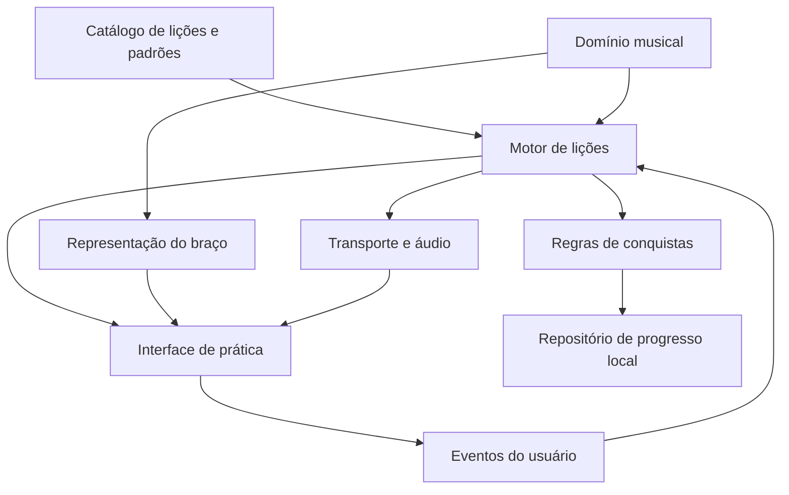

# 04 — Arquitetura e plano de execução

Status: proposta para a reconstrução; nenhuma migração de produção foi executada nesta etapa.

## 1. Estratégia

Reconstruir por fatias completas, preservando o legado como referência até o novo fluxo ser validado. Evitar trocar de framework, criar todo o currículo e refazer todos os recursos antigos de uma vez.

O conteúdo harmônico avançado seguirá como referência principal os materiais públicos da Berklee listados no currículo: prática sobre notas do acorde, motivos e variações, progressões ii–V–I, condução de vozes, escalas por acorde e tensão/resolução. Cada ideia será reduzida a uma dificuldade por etapa e validada em áudio com iniciantes; a fonte não substitui revisão musical própria nem autoriza reproduzir material protegido.

Base técnica congelada para a primeira fatia: aplicação estática com TypeScript, Vite e componentes nativos/Web Components. O benefício buscado é representar a interface a partir de dados explícitos e manter o braço reutilizável sem acoplamento a um framework. [Vite](https://vite.dev/guide/) será o ambiente/build; versões, bibliotecas de testes e dependências devem ser escolhidas e fixadas no início da implementação. React pode ser avaliado depois se a aplicação crescer a ponto de justificar a dependência, mas não é requisito desta etapa.

Essa stack é uma decisão proposta, não requisito do método. O domínio musical e o formato das lições devem funcionar independentemente de React. Sem necessidade inicial de SSR, servidor próprio, gerenciador global complexo, microserviços ou banco remoto. Firebase Hosting pode continuar servindo o resultado estático.

## 2. Separação de responsabilidades



| Área | Responsabilidades | Não deve conhecer |
| --- | --- | --- |
| `domain/music` | Pitch classes, afinação, casas, intervalos, escalas, acordes e transposição | DOM, classes CSS, storage |
| `content` | Lições, pré-requisitos, padrões, frases e metadados de áudio | Componentes React |
| `domain/learning` | Estados, evidências, marcos, desbloqueio, revisão | HTML serializado |
| `features/practice` | Interação da lição, braço, controles e feedback | Cálculo duplicado de intervalos |
| `services/audio` | Pulso, contagem, eventos sonoros, pause/resume, volumes | Pontos e desbloqueio |
| `services/progress` | Load/save, esquema, migração, backup e mesclagem | Regras musicais ou renderização |
| `features/explore` | Exploração livre sobre o mesmo domínio musical | Mecânica obrigatória de lições |

Fluxo: evento → validação → novo estado → renderização e efeitos controlados. Não ler textos/classes da tela para descobrir qual é a tônica ou se o aluno terminou.

## 3. Modelo musical

Separar os seguintes conceitos:

- `PitchClass`: inteiro 0–11, C = 0. Usado para comparação enarmônica.
- `Pitch`: altura com registro, necessária para áudio; afinação proposta em MIDI: E2=40, A2=45, D3=50, G3=55, B3=59, E4=64.
- `FretPosition`: `{ stringId, fret }`, com casa 0 representando corda solta. O número da casa não é índice deslocado oculto.
- `ScaleDefinition`: ID, intervalos em semitons e graus/grafia. Pentatônica menor: `[0, 3, 5, 7, 10]`.
- `ChordDefinition`: intervalos do acorde, separados dos da escala; Am7 e Dm7 precisam de suas próprias notas e grafias.
- `MusicalContext`: centro tonal, qualidade/contexto, acorde atual e métrica.
- `ChordScaleContext`: acorde ativo, coleção de alturas geradora, modo aplicado e grafia dos graus relativa à raiz desse acorde. Necessário para um futuro ii–V–I com modo dórico e dominante alterado, sem confundir grau do acorde com grau da tonalidade.
- `ScalePattern`: posições relativas/âncora e região; apenas subconjunto espacial de uma escala.
- `StyleBox`: coleção estilística com identidade própria; o BB King Box legado não deve entrar como fórmula de blues menor.
- `FretboardView`: janela de casas, orientação, notas destacadas e modo de rótulo.

Fórmulas do motor:

```text
midiDaNota = midiDaCordaSolta + casa
pitchClass = ((midiDaNota % 12) + 12) % 12
intervalo = ((pitchClass - tonicaPitchClass) % 12 + 12) % 12
pertenceAEscala = escala.intervalos contém intervalo
```

Grafia não pode ser reduzida só a pitch class: A# e Bb soam iguais no modelo temperado, mas o nome exibido depende do contexto. O motor deve manter grau e grafia de apresentação separados. No MVP, limitar às tonalidades autoradas e validadas; não prometer grafia correta em todos os contextos antes de implementá-la.

Gerar todas as posições de uma escala no braço e depois selecionar uma região pedagógica. Padrões devem ser validados contra a fórmula musical. Se uma região não cabe, escolher outra posição válida ou avisar explicitamente; não recortar silenciosamente como hoje.

Uma lição também pode destacar uma nota-alvo do acorde fora da escala base. Em L10, F sobre Dm7 é esse caso: identificá-la como nota contextual, sem alterar a fórmula da pentatônica de Am ou fingir que pertence a ela. O estado da lição deve registrar o acorde ativo e seus alvos por trecho; rótulos, destaque no braço, checagem e áudio usam a mesma fonte de dados.

Na evolução jazzística, uma mesma coleção pode servir a dois acordes com funções diferentes: em `Cm7 → F7alt → B♭maj7`, Si♭ maior gera o material de Cm dórico e B♭ maior; F♯ menor melódica gera F alterado. O modo e os graus exibidos devem seguir o **acorde ativo**, enquanto a coleção geradora permanece registrada separadamente. Transições de acorde devem atualizar nota-alvo, rótulo e acompanhamento no mesmo compasso. Esse contrato é futuro; o componente atual do `/lab/` ainda mostra uma escala e uma tônica estáticas por vez.

O catálogo atual fornece fixtures de comparação. Normalizar âncoras e graus, eliminar dados redundantes quando possível e revisar os nomes CAGED antes de expô-los em lições. Não importar snapshots HTML para o novo domínio.

## 4. Modelo de lição

Esboço de contrato, a detalhar junto da primeira lição executável:

O contrato deve ser declarativo e validável, mantendo aberta a possibilidade futura de um editor de lições. Isso não implica construir o editor no MVP; evita atrelar notas, áudio e etapas a HTML ou código executável específico de cada lição.

```typescript
type LessonRef =
  | { source: 'system'; trackId: string; lessonId: string }
  | { source: 'user'; ownerId: string; lessonId: string };

type Lesson = {
  ref: LessonRef;             // system:fundamentals:l03 ou user:<ownerId>:<lessonId>
  contentRevision: number;
  collectionId: string;       // organização; pode mudar sem alterar a identidade
  moduleId: string;
  prerequisites: string[];
  title: string;
  objective: string;
  theory?: {
    summary: string;
    conceptMap: TheoryNode[];
    deeperReadings?: TheoryBlock[];
  };
  context: {
    tonicPitchClass: number;
    scaleId: string;
    meter: [number, number];
    bpm: { initial: number; min: number; max: number };
    backingId: string;
  };
  steps: LessonStep[];
  assessment: {
    visualCheckIds: string[];
    selfReportCriteria: string[];
  };
};

type TheoryNode = {
  id: string;
  label: string;
  relation?: string;
  children?: TheoryNode[];
};

type TheoryBlock = {
  title: string;
  body: string;
  exampleAudioId?: string;
  visual?: TheoryVisual;
};

type TheoryVisual =
  | { type: 'comparison-table'; columns: string[]; rows: string[][] }
  | { type: 'concept-map'; nodes: TheoryNode[] }
  | { type: 'fretboard-mini'; positions: FretPosition[]; labels: ('note' | 'degree')[] }
  | { type: 'timeline'; beats: number; events: { beat: number; label: string }[] }
  | { type: 'voice-leading'; from: string; to: string; interval: string };
```

`LessonStep` será uma união discriminada: ouvir demonstração, localizar posição, imitar, improvisar com restrição, responder checagem e autoavaliar. Cada tipo deve declarar duração musical quando aplicável, notas/posição, ajuda disponível e condição de avanço. Não usar objetos permissivos com qualquer combinação de campos.

Frases de referência devem ser eventos `{ midi, startBeat, durationBeats }`; silêncio é espaço na linha do tempo. Acompanhamento descreve acordes por duração em compassos. Rótulos e notas audíveis derivam dos mesmos dados. O esquema precisa incluir pré-requisitos, licenças/autoria de assets, versões e validações de referências inexistentes/ciclos.

## 5. Estado da prática e áudio

Estados mínimos: `idle`, `loading`, `ready`, `count-in`, `playing`, `paused`, `review`, `completed`, `error`.

Eventos explícitos: `START`, `PAUSE`, `RESUME`, `REPEAT`, `STEP_FINISHED`, `ANSWER`, `SELF_REPORT`, `LEAVE`, `AUDIO_INTERRUPTED`. Conclusão exige as evidências da lição; não decorre apenas de `STEP_FINISHED` por tempo.

Um transporte controla posição em batidas/compassos e agenda áudio pelo relógio de áudio. A interface acompanha esse transporte; `setInterval` não deve ser o relógio musical principal. Parar deve cancelar eventos e vozes agendadas, não apenas congelar a animação. Ao retomar, gerar contagem e reiniciar a frase conforme a regra do passo.

Protótipo de áudio: comparar síntese simples e pequenos samples próprios; escolher pela inteligibilidade e sincronização em celular. Não fazer pitch-shift bruto de uma faixa gravada ao alterar BPM se isso mudar a tonalidade. Agendamento por notas permite variar tempo preservando alturas.

### 5.1. Como uma microfrase toca no navegador

Uma microfrase não será armazenada apenas como “áudio da lição”. O conteúdo declarará os eventos musicais e o transporte decidirá quando dispará-los:

```js
const phrase = [
  { midi: 57, startBeat: 0, durationBeats: 1 }, // A
  { midi: 60, startBeat: 1.5, durationBeats: 0.5 }, // C
  { midi: 64, startBeat: 2, durationBeats: 1 } // E
];
```

O navegador converte `startBeat` em segundos usando o BPM da sessão e agenda cada nota no `AudioContext`. Uma voz simples começa com um pequeno sample próprio de guitarra ou uma síntese percussiva inteligível; depois podemos trocar o timbre sem alterar a lógica da lição. O mesmo relógio agenda o clique, o acompanhamento, a animação do braço e o destaque da nota atual.

O fluxo da primeira versão será:

1. a pessoa toca **Ouvir**; o gesto libera o `AudioContext` do navegador;
2. o app faz uma contagem curta;
3. a microfrase de referência toca, com as notas destacadas no braço;
4. a pessoa escolhe **Repetir**, **Mais lento** ou **Praticar com acompanhamento**;
5. durante a prática, o app fornece pulso, espaço e acompanhamento, mas não afirma que detectou a execução da guitarra;
6. ao final, a pessoa registra uma autoavaliação simples e pode tentar novamente.

O player terá três intenções visuais distintas:

- **Ouvir exemplo**: toca a microfrase completa e destaca cada posição no braço no instante correspondente, com cursor de pulso e opção de repetir devagar.
- **Imitar com guia**: repete a frase em blocos curtos; o highlight pode aparecer no primeiro ciclo e desaparecer ou ficar reduzido no ciclo seguinte para incentivar a memória auditiva.
- **Praticar com acompanhamento**: mantém acordes, contagem e marcadores de compasso, mas não simula que detectou a execução do praticante nem ilumina notas como se estivesse acompanhando o instrumento.

Uma nota individual também poderá ser acionada para ouvir sua altura. O highlight é uma representação do que o app está tocando, não uma avaliação do que a pessoa tocou.

Isso permite mudar BPM, repetir apenas dois compassos e transportar a frase sem alterar a afinação. O reconhecimento do som captado pelo microfone, a comparação automática da execução e a gravação da performance ficam fora do MVP; são problemas diferentes e exigem testes de latência, ruído e privacidade.

Criar/retomar contexto sonoro a partir de gesto do usuário, disponibilizar volume e pausa. Ver [boas práticas de Web Audio da MDN](https://developer.mozilla.org/en-US/docs/Web/API/Web_Audio_API/Best_practices). A capacidade real de manter sincronização deverá ser medida nos navegadores-alvo; não foi validada nesta fase.

## 6. Progresso e migração

Persistir dados, nunca DOM. Contrato sugerido para exportação e visão agregada:

```json
{
  "schemaVersion": 2,
  "curriculumVersion": "improv-foundations-1",
  "updatedAt": "2026-10-06T15:00:00.000Z",
  "preferences": {
    "locale": "pt-BR",
    "instrument": "acoustic-guitar",
    "orientation": "right-handed",
    "labelMode": "note"
  },
  "resume": { "lessonKey": "system:fundamentals:l03", "contentRevision": 1, "stepId": "create" },
  "tracks": {
    "system:fundamentals": { "status": "in_progress", "recommendedNextLessonKey": "system:fundamentals:l03" }
  },
  "lessons": {
    "system:fundamentals:l01": {
      "contentRevision": 1,
      "milestones": {
        "practice": { "attemptId": "example-1", "earnedAt": "2026-10-06T15:00:00.000Z" }
      },
      "lastPracticedLocalDate": "2026-10-06",
      "reviewStage": 0,
      "nextReviewLocalDate": "2026-10-07"
    }
  }
}
```

Este JSON é o **modelo alvo de exportação**, mais amplo que o armazenamento simples já usado pela L01. IDs com prefixo `system:` e `user:` evitam colisão entre lições oficiais e pessoais; o progresso continua pertencendo ao praticante, nunca ao autor do conteúdo. Ver [09 — Lições oficiais e dos usuários](09-licoes-oficiais-e-dos-usuarios.md) para autoria, categorias, revisões e migração futura para contas.

Tentativas terão ID único, versão da lição, respostas visuais, uso de dica, BPM e autoavaliação. Os marcos `practice`, `application`, `review` obedecem às regras do documento de produto. Estrelas, pontos e desbloqueios são derivados; não manter cópias concorrentes desses totais.

Datas de conquista em UTC; datas de prática/revisão conforme dia local do praticante, registrando o fuso da tentativa. Não inferir fraude de mudanças de relógio/fuso. Limitar histórico detalhado e preservar marcos para evitar crescimento ilimitado.

Interface sugerida de repositório: `load`, `saveAttempt`, `awardMilestone`, `savePreferences`, `export`, `importAndMerge`, `resetOwnData`. Uma futura implementação com conta deve poder substituir o armazenamento sem alterar as regras de aprendizagem.

Chaves com prefixo/versionamento próprios, como `pentashapes:v1:*`. Para duas abas, salvar tentativas e marcos em chaves identificadas por IDs, evitando que um único documento de “progresso completo” sobrescreva conquistas concorrentes. Reconciliar a união dos marcos, recalcular totais e limitar a prática sonora a uma aba ativa. Preferências/retomada podem usar última gravação com aviso quando necessário. O evento [`storage`](https://developer.mozilla.org/en-US/docs/Web/API/Window/storage_event) ajuda a detectar alterações feitas por outra aba da mesma origem; a aba que escreve atualiza o próprio estado diretamente.

Importação: validar tipo, tamanho, versões, IDs, datas e dependências dos marcos; rejeitar inconsistências sem sobrescrever o histórico. Mesclar por IDs e marcos únicos. Mudanças de conteúdo mantêm conquistas anteriores identificadas por versão; se houver nova competência, recomendar revisão ou criar novo ID, sem apagar trabalho do aluno.

Não há progresso persistido legado a migrar. O preset de quartas precisa ser reescrito como seleção de escala/tonalidade/região se for reintroduzido; a lista aberta numa aba antiga não terá migração automática nesta proposta.

## 7. Backlog em ordem de dependência

| Etapa | Entrega concreta | Condição para avançar |
| --- | --- | --- |
| 0 — Diagnóstico | Estes documentos e auditoria do legado | Escopo e hipóteses explícitos; concluído nesta etapa |
| 1 — Protótipo de experiência | Telas de início, L03 e resultado, com conteúdo real e áudio de exemplo | Revisão de hierarquia, legibilidade e rubrica com autor/professor |
| 2 — Fundação musical | Motor de notas/intervalos, recorte do braço e catálogo normalizado | Comparações contra dados auditados, testes de limites e transposição |
| 3 — Fatia de produto | L01–L03 com áudio, prática, estrelas, salvar/retomar e backup | Fluxo completo em desktop e celular; sem discrepância entre guia e som |
| 4 — Piloto pedagógico | Sessões observadas e retorno posterior | Corrigir barreiras de compreensão antes de ampliar |
| 5 — MVP curricular | Trilha Fundamentos L04–L12, revisões e explorador enxuto | Conteúdo revisado, critérios de aceite satisfeitos |
| 6 — Preparação de publicação | Build, preview, QA, documentação e recuperação de release | Revisão de experiência, persistência e deploy; publicar apenas na etapa própria |
| 7 — Evolução | Módulo autoral de ii–V–I com dominante alterado e condução de frases; depois transposição pelo ciclo de quartas/quintas, CAGED ampliado, blues, novos tons, contas ou detecção | Priorizar pelos resultados reais do MVP; validar áudio, grafia, graus por acorde, transposição e prática instrumental do módulo |

Não há estimativa de prazo fechada: autoria de áudio, revisão musical e resultado do piloto determinam esforço. Etapas 1 e 3 são os principais pontos de redução de incerteza.

## 8. Verificações da futura implementação

| Área | Casos significativos |
| --- | --- |
| Música | 12 transposições, afinação, casa zero, limites do braço, relação entre nota/grau/acorde, relativas com graus distintos |
| Padrões | Cada nota pertence à fórmula declarada; distinção entre escala e box estilístico; recorte não perde tônica obrigatória |
| Conteúdo | IDs únicos, pré-requisitos sem ciclos, exemplos e backing no contexto correto, referências de áudio existentes |
| Progresso | Repetição idempotente, marco inválido rejeitado, importação/mesclagem, corrupção, migração e múltiplas abas |
| Tempo | Pausa cancela áudio, retomada com contagem, mudança de BPM, aba oculta e interrupções do dispositivo |
| Interface | Primeiro acesso, teclado/touch, mudança de orientação, dica, feedback, reload e falha de storage |
| Pedagogia | Observação humana de frase, pausa, motivo e resolução; não substituir por testes automatizados |

Testes unitários concentram-se no domínio e nas regras de progresso. Fluxos ponta a ponta cobrem poucas jornadas críticas. Validação visual e sonora será feita em navegadores reais, especialmente celular; não basta screenshot de desktop.

O pipeline futuro deve executar checks e build antes de publicar. Adaptar o diretório de hosting à saída do build; não servir fontes TypeScript como se fossem o app pronto. Usar preview para revisar. Manter release anterior recuperável e histórico de Git para rollback; esta documentação não disparou deploy.

## 9. Decisões pendentes e proposta padrão

| Decisão | Proposta para destravar o próximo passo |
| --- | --- |
| Nível do público | Confirmado: toca acordes, começando improvisação |
| Avaliação instrumental | Autoavaliação no MVP; microfone em pesquisa futura |
| Método inicial | Pentatônica menor de Am com fraseado, alvos e expansão gradual |
| Primeira plataforma | Web responsiva, celular e desktop; PWA preparada, sem aplicativo nativo no primeiro ciclo |
| Persistência | LocalStorage + backup versionado |
| Idioma inicial | Português brasileiro com chaves de tradução desde o primeiro componente; cifras internacionais e nomes locais de notas |
| Estilo musical | Frases expressivas desde o início; cor jazzística gradual com Am7 e Am7–Dm7 em L09–L12; módulos posteriores guiados por ideias da Berklee sobre ii–V–I, notas do acorde e condução de vozes |
| Referência pedagógica | Berklee como referência principal para improvisação harmônica/jazzística; adaptar linguagem, ordem e dificuldade ao público iniciante |
| Conteúdo sonoro | Exemplos próprios; registrar responsável por produção/revisão |
| Nome/identidade | Manter PentaShapes por enquanto; validar se comunica a nova promessa |
| Tutorial original | Link ainda não fornecido; registrar posteriormente para rastrear a inspiração |

Essas pendências não impedem a primeira fatia. As decisões congeladas e os portões estão detalhados em [07 — Prontidão para implementação](07-prontidao-implementacao.md); reconhecimento de áudio, contas e app nativo continuam fora do primeiro ciclo.
